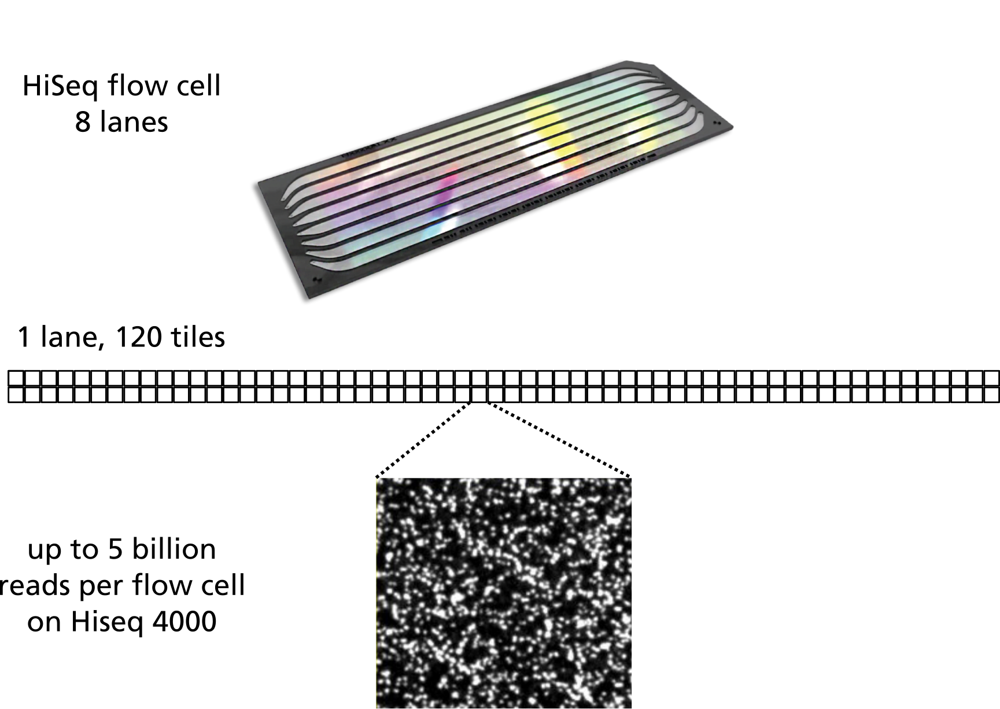

---
# Please do not edit this file directly; it is auto generated.
# Instead, please edit 01-background.md in _episodes_rmd/
title: "Background and metadata"
teaching: 15
source: Rmd
questions:
- "What data are we using?"
- "Why is this experiment important?"
objectives:
- "Understand the data set"
- "What is hypermutability?"
---

## The experiment

The data we are going to use is part of a long-term evolution experiment led by [Richard
Lenski](https://en.wikipedia.org/wiki/E._coli_long-term_evolution_experiment).
 
The experiment was designed to assess adaptation in *E. coli* . Twelve populations of *E. coli*
strain [REL606][REL606] were propagated for more than 40,000 generations in a glucose-limited
minimal medium (in most conditions glucose is the best carbon source for *E. coli*, providing
faster growth than other sugars). This medium was supplemented with citrate, which *E. coli* cannot
metabolize in the aerobic conditions of the experiment. Sequencing of the populations at regular
time points revealed that spontaneous citrate-using variant (*Cit+*) appeared between 31,000 and
31,500 generations of the *Ara-3* population. in the causing an increase in population size and
diversity. In addition, this experiment showed hypermutability in some populations. Hypermutability
is important and can help accelerate adaptation to novel environments, but also can be selected
against in well-adapted populations.
 
To see a timeline of the experiment to date, check out this
[figure](https://en.wikipedia.org/wiki/E._coli_long-term_evolution_experiment#/media/File:LTEE_Timeline_as_of_May_28,_2016.png),
and this paper [Blount et al. 2008: Historical contingency and the evolution of a key innovation in
an experimental population of *Escherichia coli*](http://www.pnas.org/content/105/23/7899).

## The data

The sequencing data is from Illumina sequencers, which use *flow cells*, which are divited into *lanes*, which are divided into *tiles*. The FASTQ files we will use later has information on the lanes, tiles, and positions. It's useful to be familiar with the general organisation of the data, as shown below (the exact number and layout of tiles per lane varies for different flow cells):

 
 
## The metadata

We will be working with three sample events from the *Ara-3* strain of this experiment, one from
5,000 generations, one from 15,000 generations, and one from 50,000 generations. The population
changed substantially during the course of the experiment, and we will be exploring how (the
evolution of a *Cit+* mutant and **hypermutability**) with our variant calling workflow. The
metadata file associated with this lesson can be [downloaded directly
here](https://raw.githubusercontent.com/data-lessons/wrangling-genomics/gh-pages/files/Ecoli_metadata_composite.csv)
or [viewed in
Github](https://github.com/data-lessons/wrangling-genomics/blob/gh-pages/files/Ecoli_metadata_composite.csv).
If you would like to know details of how the file was created, you can look at [some notes and
sources
here](https://github.com/data-lessons/wrangling-genomics/blob/gh-pages/files/Ecoli_metadata_composite_README.md).

This metadata describes information on the *Ara-3* clones and the columns represent:

| Column           | Description                                |
|------------------|--------------------------------------------|
| strain           | strain name					|
| generation       | generation when sample frozen		|
| clade            | based on parsimony-based tree		|
| reference        | study the samples were originally sequenced for				|
| population       | ancestral population group |
| mutator          | hypermutability mutant status |
| facility         | facility samples were sequenced at |
| run              | Sequence read archive sample ID		|
| read_type        | library type of reads |
| read_length      | length of reads in sample |
| sequencing_depth | depth of sequencing |
| cit              | citrate-using mutant status		|

> ## Challenge
>
> Based on the metadata, can you answer the following questions?
>
> * How many different generations exist in the data?
> * How many rows and how many columns are in this data?
> * How many citrate+ mutants have been recorded in *Ara-3*?
> * How many hypermutable mutants have been recorded in *Ara-3*?
> 
> > ## Solution
> >
> > We will address the metadata questions in R
> > 
> > 
> > ~~~
> > library(tidyverse)
> > ~~~
> > {: .language-r}
> > 
> > 
> > 
> > ~~~
> > ── Attaching packages ────────────────────────────────── tidyverse 1.2.1 ──
> > ~~~
> > {: .output}
> > 
> > 
> > 
> > ~~~
> > ✔ ggplot2 3.1.0     ✔ purrr   0.3.0
> > ✔ tibble  2.0.1     ✔ dplyr   0.7.8
> > ✔ tidyr   0.8.2     ✔ stringr 1.4.0
> > ✔ readr   1.3.1     ✔ forcats 0.3.0
> > ~~~
> > {: .output}
> > 
> > 
> > 
> > ~~~
> > ── Conflicts ───────────────────────────────────── tidyverse_conflicts() ──
> > ✖ dplyr::filter() masks stats::filter()
> > ✖ dplyr::lag()    masks stats::lag()
> > ~~~
> > {: .output}
> > 
> > 
> > 
> > ~~~
> > metadata <- read_csv("https://raw.githubusercontent.com/data-lessons/wrangling-genomics/gh-pages/files/Ecoli_metadata_composite.csv")
> > ~~~
> > {: .language-r}
> > 
> > 
> > 
> > ~~~
> > Parsed with column specification:
> > cols(
> >   strain = col_character(),
> >   generation = col_double(),
> >   clade = col_character(),
> >   reference = col_character(),
> >   population = col_character(),
> >   mutator = col_character(),
> >   facility = col_character(),
> >   run = col_character(),
> >   read_type = col_character(),
> >   read_length = col_double(),
> >   sequencing_depth = col_double(),
> >   cit = col_character()
> > )
> > ~~~
> > {: .output}
> > 
> > 
> > 
> > ~~~
> >                                         # generations
> > length(unique(metadata$generation))
> > ~~~
> > {: .language-r}
> > 
> > 
> > 
> > ~~~
> > [1] 25
> > ~~~
> > {: .output}
> > 
> > 
> > 
> > ~~~
> >                                         # rows and columns
> > list(rows=nrow(metadata),cols=ncol(metadata))
> > ~~~
> > {: .language-r}
> > 
> > 
> > 
> > ~~~
> > $rows
> > [1] 62
> > 
> > $cols
> > [1] 12
> > ~~~
> > {: .output}
> > 
> > 
> > 
> > ~~~
> >                                         # citrate+
> > table(metadata$cit)
> > ~~~
> > {: .language-r}
> > 
> > 
> > 
> > ~~~
> > 
> >   minus    plus unknown 
> >      12      10      39 
> > ~~~
> > {: .output}
> > 
> > 
> > 
> > ~~~
> >                                         # hypermutable
> > table(metadata$mutator)
> > ~~~
> > {: .language-r}
> > 
> > 
> > 
> > ~~~
> > 
> > None plus 
> >   48    6 
> > ~~~
> > {: .output}
> > 
> > 
> > 
> > ~~~
> >                                         # are hypermutators only in cit+ mutants?
> > table(metadata$mutator,metadata$cit)
> > ~~~
> > {: .language-r}
> > 
> > 
> > 
> > ~~~
> >       
> >        minus plus unknown
> >   None    11    5      32
> >   plus     1    5       0
> > ~~~
> > {: .output}
>{: .solution}
>
{: .challenge}

[REL606]: http://ecoliwiki.net/colipedia/index.php/Category:Strain:REL606
